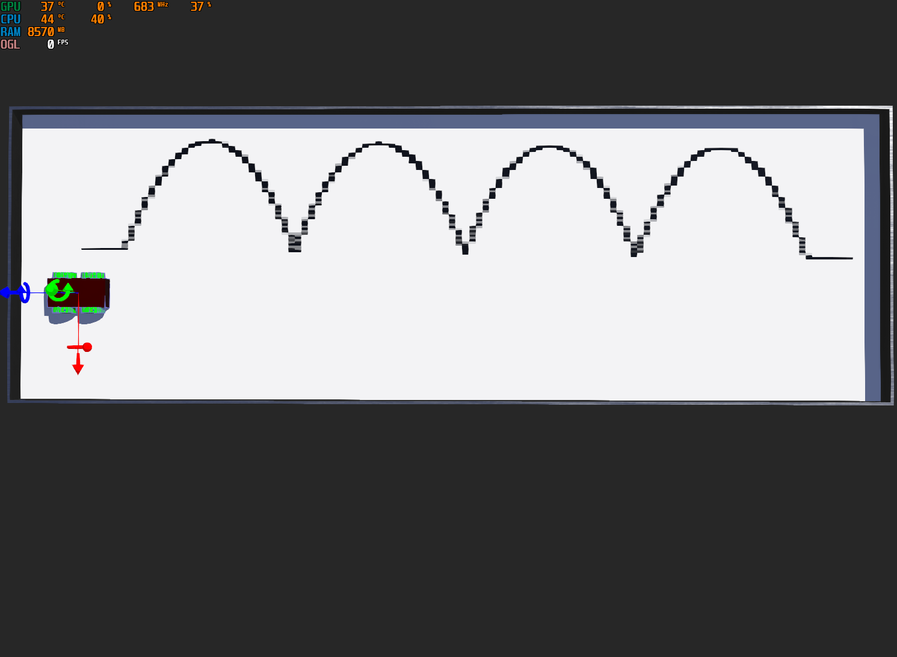

# CSCI-455-Final-Project

## By Dan Bachler and Jesse Arstein

A custom built robot that draws 4 curves

# Purpose/Assignment

This assignment was to create a custom robot in [Webots](https://www.cyberbotics.com) that has 4 wheels that drive independently.  This robot had to start by drawing a straight line, followed by 4 identical curves, followed by another straight line that was on roughly the same level as the first straight line.  An example of the output of running the program is shown below. 

The `bachler-arstein-world.wbt` file contains the required world and robot setup.

The controller file is `my_controller.py` which requires an external file called `ellipse.py`.

# Tools/Design

The straight lines are simple distance calculations, but the curves required a more advanced approach.  

To create the curves an `Ellipse.ellipse` object is generated using the starting GPS coordinates of the robot and the desired length of the curve.  This `Ellipse.ellipse` object converts the two provided points into an array of GPS coordinates that will create a curve shape when traveled.  The robot then uses the Webots GPS and Compass system to navigate from point to point.  There are several helper functions that facilitate this.

The first function takes in a heading on the compass in degrees and rotates the robot to be facing in the desired direction within 0.2 degrees.

The second function when given a target GPS coordinate will drive the robot forward until the robot is within 0.01m of the target coordinates.

# Running

To run this program Webots must be installed, with the proper version of Python (3.7.X) installed.  Load the `bachler-arstein-world.wbt` file to get the robot, and either run the `my_controller.py` file as an external controller if configured on your system, or create a new controller with the controller wizard and import the controller manually.  Ensure that the `ellipse.py` file is in the same directory as the controller file.